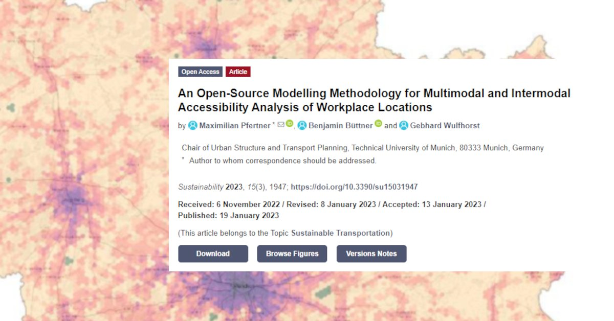

𝗡𝗲𝘄 𝗽𝗮𝗽𝗲𝗿 𝗮𝗹𝗲𝗿𝘁 from our research project EMMA: “An Open-Source Modelling Methodology for Multimodal and Intermodal Accessibility Analysis of Workplace Locations”, just published in Sustainability: https://www.mdpi.com/2071-1050/15/3/1947

We define "auto-independent" workplaces as those that are accessible by multiple modes of transportation: by car, but also with alternatives such as public transport, bicycles, or a combination of them. To analyze this, we have introduced a new methodology based on open-source tools such as OpenTripPlanner, PostGIS, and R. Free and replicable for anyone, anywhere.

The Munich metropolitan region serves as our case study, and we demonstrate the potential to conduct large-scale, multimodal, and intermodal accessibility analyses. The results show that Munich and other major centers in the region unsurprisingly exhibit high competitiveness for cycling, public transport, and intermodal transportation. However, it is also interesting to note that smaller communities often perform well within our 30-minute evaluation period.

This regional analysis is particularly useful in the analysis of planning scenarios, such as "How will the accessibility of a location change if we open a new S-Bahn stop?" and provides broad overviews of the accessibility of workplaces.

We are excited to share these findings with you and hope that they will contribute to the promotion of sustainable mobility in workplaces. If you are interested in the details, contact our authors Maximilian Pfertner, Benjamin Büttner, and Gebhard Wulfhorst!

